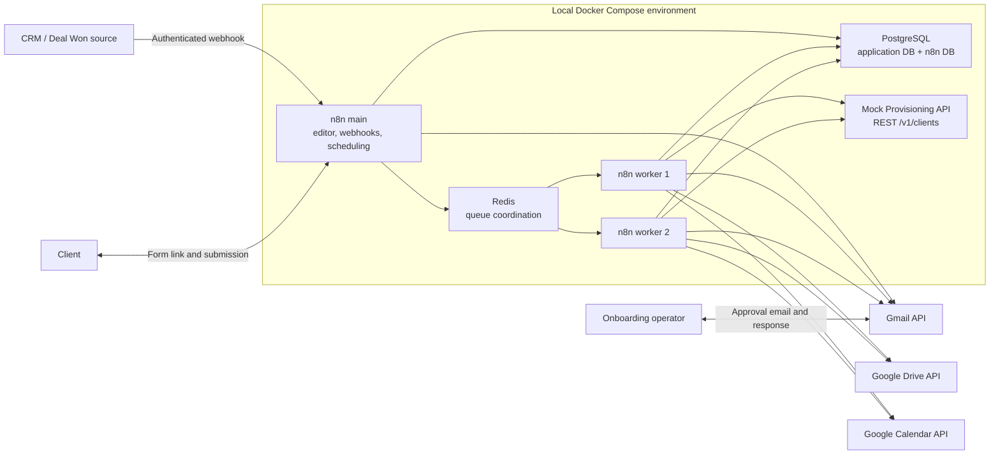

# Production-Grade B2B Client Onboarding Platform

A production-oriented portfolio implementation of a stateful B2B client onboarding process built with n8n, PostgreSQL, Redis, Docker Compose, REST APIs, Google Drive, Google Calendar, and Gmail.

The platform models the work that begins after a CRM deal is marked as won: collect authoritative client data, validate it, obtain a human approval, provision an external account, create onboarding resources, notify the internal team, and retain an auditable record of every state transition and external side effect.

> This repository demonstrates production-grade reliability patterns in a local portfolio environment. It is not presented as a production deployment or as evidence of outcomes for real customers.

## Table of contents

- [Problem](#problem)
- [Solution](#solution)
- [Workflow overview](#workflow-overview)
- [Architecture](#architecture)
- [Reliability features](#reliability-features)
- [Database overview](#database-overview)
- [Repository structure](#repository-structure)
- [Local setup](#local-setup)
- [Environment variables](#environment-variables)
- [Testing](#testing)
- [Confirmed runtime scenario](#confirmed-runtime-scenario)
- [Portfolio demonstration](#portfolio-demonstration)
- [Tech stack](#tech-stack)
- [Project status](#project-status)

## Problem

Manual B2B onboarding often spreads one process across CRM notes, email threads, spreadsheets, shared folders, calendar invitations, and an internal provisioning system. That creates several engineering and operational risks:

- duplicate processing when the same deal event is delivered more than once;
- incomplete or invalid client data becoming authoritative too early;
- unclear ownership of the current onboarding state;
- duplicate emails, folders, meetings, or provisioned accounts after retries;
- race conditions when several automation workers process the same case;
- lost work after a workflow crashes between an external API call and a database write;
- manual follow-up for retryable failures without a durable retry schedule;
- limited auditability across submissions, approvals, external operations, and errors;
- tight coupling between workflow execution history and business state.

## Solution

The platform separates orchestration from authoritative state:

- **PostgreSQL** owns onboarding cases, steps, submissions, token lifecycle, client records, external operations, events, and errors.
- **n8n** validates workflow contracts, coordinates human and system interactions, and calls external services.
- **Redis** supports n8n queue mode and multiple workers.
- **Deterministic operation keys** make external work idempotent.
- **Leases and compare-and-set transitions** coordinate concurrent workers.
- **Reconciliation** checks Gmail, Drive, and Calendar before repeating an ambiguous side effect.
- **WF98** discovers due retries and stale leases from persisted state.
- **WF99** normalizes unexpected failures and handles operator-intervention notifications.

The intended business flow is:

```text
Deal Won
  -> create or reuse onboarding case
  -> request client data
  -> store an immutable submission
  -> validate and create or reuse the canonical client
  -> request manual approval
  -> provision the external client account
  -> create the Drive folder
  -> create the kickoff event
  -> notify the internal team
  -> complete the onboarding case
```

Validation failure returns the case to a new client-data request cycle. Approval rejection is terminal. Retryable technical failures remain persisted and are retried only when eligible.

## Workflow overview

| Workflow | Responsibility | Repository artifact |
| --- | --- | --- |
| **WF01 Intake Deal Won** | Authenticate and normalize a CRM `Deal Won` webhook, create or reuse one onboarding case, record intake events, and dispatch WF02 when required. | Contract: [`docs/workflow-contracts/WF01-intake-deal-won.md`](docs/workflow-contracts/WF01-intake-deal-won.md). An executable workflow export is not currently checked in. |
| **WF02 Request Client Data** | Create or reuse a secure request cycle, deliver a single-use n8n form link through Gmail, and persist the delivery result. | [`n8n/workflows/WF02-request-client-data.json`](n8n/workflows/WF02-request-client-data.json) |
| **WF03 Receive and Validate Client Data** | Authorize the form submission, consume the token, store an immutable submission, validate it, and create or reuse the canonical client. | [`n8n/workflows/WF03-receive-and-validate-client-data.json`](n8n/workflows/WF03-receive-and-validate-client-data.json) |
| **WF04 Manual Approval** | Send one approval request through Gmail, wait for approve or reject, and persist the authoritative decision. | [`n8n/workflows/WF04-manual-approval.json`](n8n/workflows/WF04-manual-approval.json) |
| **WF05 Provision Client** | Call the idempotent Mock Provisioning API and persist the external client identifier or failure state. | [`n8n/workflows/WF05-provision-client.json`](n8n/workflows/WF05-provision-client.json) |
| **WF06 Finalize Onboarding** | Create or reconcile the Drive folder, Calendar kickoff event, and Gmail team notification before completing the case. | [`n8n/workflows/WF06-finalize-onboarding.json`](n8n/workflows/WF06-finalize-onboarding.json) |
| **WF98 Retry Dispatcher** | Find due retryable operations, expired leases, and supported state gaps, then dispatch work to the owning workflow. | [`n8n/workflows/WF98-retry-dispatcher.json`](n8n/workflows/WF98-retry-dispatcher.json) |
| **WF99 Central Error Handler** | Sanitize and persist unexpected failures and manage idempotent operator-intervention notifications. | [`n8n/workflows/WF99-central-error-handler.json`](n8n/workflows/WF99-central-error-handler.json) |

Detailed contracts define inputs, state prerequisites, idempotency rules, failure semantics, and safe outputs for every workflow in [`docs/workflow-contracts`](docs/workflow-contracts).

## Architecture



### Components

- **n8n main** exposes the editor, webhooks, form trigger, schedule trigger, and queue coordination endpoint.
- **Two n8n workers** execute queued jobs with configurable concurrency.
- **PostgreSQL** contains separate application and n8n databases. Business state never depends on n8n execution history.
- **Redis** coordinates queue-mode execution; it is not used as the business datastore.
- **Docker Compose** provides repeatable local infrastructure, health checks, persistent volumes, and a private backend network.
- **Mock Provisioning API** is a deterministic external REST boundary with an `Idempotency-Key` contract and controlled success, retryable, and terminal scenarios.
- **Google Drive** stores one onboarding folder for a finalized case.
- **Google Calendar** stores the kickoff event.
- **Gmail** delivers client-data requests, approval requests, team notifications, and operator-intervention notifications.

See [`docs/architecture.md`](docs/architecture.md) for the complete state machine, trust boundaries, invariants, and external-operation protocol.

## Reliability features

### PostgreSQL as the source of truth

n8n coordinates work, but PostgreSQL decides whether a transition or external operation is valid. Workflows reread authoritative records before state-sensitive actions.

### Idempotency

Each external side effect has a deterministic, unique `idempotency_key`. The provisioning API also accepts the key in the HTTP `Idempotency-Key` header and returns the original result for a safe replay.

### Leases and concurrency control

An operation is atomically claimed with a lease owner and expiry. Another worker cannot claim the same work while the lease remains valid. Expired leases can be evaluated for recovery.

### Bounded retries

Retryable failures store an attempt count, maximum attempts, and `next_retry_at`. WF98 uses PostgreSQL time to find eligible work and dispatches it to the workflow that owns the operation.

### Reconciliation

Before repeating an ambiguous request, workflows search the provider using deterministic markers:

- Gmail message markers;
- Google Drive `appProperties`;
- Google Calendar private extended properties.

### Duplicate prevention

Database constraints enforce one case per source deal, one case per source event, one active token per case, immutable request-cycle identity, and one external operation per deterministic key.

### Append-only events

`onboarding_events` records business history. A PostgreSQL trigger rejects updates and deletes so that audit events remain append-only.

### Centralized error handling

WF99 separates technical errors from normal business outcomes, sanitizes retained details, writes `error_log`, and manages deduplicated intervention notifications.

### Additional safeguards

- single-use, expiring form tokens;
- SHA-256 token hashes and temporary AES-GCM-encrypted delivery material;
- immutable versioned submissions;
- canonical client data created only from a passed submission;
- explicit case-state and operation-state transition guards;
- no automatic deletion of already successful external resources after a later failure.

## Database overview

The application schema is introduced by [`db/migrations/001_foundation.sql`](db/migrations/001_foundation.sql) and extended by workflow-specific migrations through `013`.

| Table | Purpose |
| --- | --- |
| `clients` | Canonical validated B2B client identity and contact data. |
| `onboarding_cases` | One authoritative case per source deal, including current state and links to the accepted submission and client. |
| `onboarding_steps` | The seven required steps and their attempt, wait, approval, and completion state. |
| `onboarding_form_tokens` | Hashed, expiring, single-use form-token lifecycle and temporary encrypted delivery material. |
| `onboarding_submissions` | Immutable, versioned client submissions and deterministic validation results. |
| `onboarding_events` | Append-only business audit events keyed for idempotent insertion. |
| `external_operations` | Durable side-effect identity, claim lease, attempts, retry schedule, provider identifier, and sanitized result. |
| `error_log` | Sanitized technical and integration failures, separate from business events. |

The seven steps initialized for every case are:

1. `collect_client_data`
2. `validate_client_data`
3. `manual_approval`
4. `provision_client`
5. `create_drive_folder`
6. `create_kickoff_event`
7. `notify_team`

Migration groups:

- `001`: foundation tables, constraints, triggers, state guards, token consumption, operation claim/completion helpers;
- `002`–`010`: WF02/WF03 token delivery, retry, reconciliation, and validation finalization;
- `011`: WF04 approval preparation and finalization;
- `012`: WF05 provisioning preparation and finalization;
- `013`: WF06 finalization preparation, operation completion, and case completion.

## Repository structure

```text
.
├── .env.example
├── README.md
├── docker-compose.yml
├── docker-compose.override.yml
├── db/
│   ├── init/                       # Application and n8n database bootstrap
│   ├── migrations/                 # Ordered SQL migrations 001-013
│   └── tests/                      # Transactional SQL verification suites
├── docs/
│   ├── architecture.md
│   ├── project-plan.md
│   └── workflow-contracts/         # WF01-WF06, WF98, and WF99 contracts
├── n8n/
│   └── workflows/                  # Exported WF02-WF06, WF98, and WF99 JSON
├── scripts/                        # Targeted workflow checks and patch/deploy helpers
└── services/
    └── mock-provisioning-api/
        ├── Dockerfile
        ├── package.json
        ├── src/
        └── test/
```

## Local setup

### Prerequisites

- Docker Engine or Docker Desktop with Docker Compose v2;
- Git;
- `curl` for service health checks;
- `jq` for workflow JSON validation;
- Node.js 24 or a compatible modern Node.js runtime for local static checks;
- a Google Cloud OAuth project with Gmail, Drive, and Calendar APIs enabled if real Google integration tests are required.

### 1. Clone and configure

```bash
git clone <repository-url>
cd b2b-client-onboarding-platform
cp .env.example .env
```

Replace every `replace_with_...` value in `.env`. Use unique credentials for the PostgreSQL admin, application database, n8n database, Redis, n8n encryption, and client-token encryption settings.

`docker-compose.override.yml` also requires `OPERATOR_INTERVENTION_RECIPIENT_EMAIL`. Add it to the local `.env`; the optional WF99 sender, template, lease, and attempt variables are described below.

Never commit `.env`, OAuth tokens, exported credentials, approval links, form tokens, screenshots containing secrets, or decrypted n8n exports.

### 2. Start the local stack

```bash
docker compose up -d --build
docker compose ps
```

The stack starts PostgreSQL, Redis, n8n main, two n8n workers, and the Mock Provisioning API. PostgreSQL bootstrap creates the application and n8n databases only when the data volume is initialized.

### 3. Apply migrations

```bash
for migration in db/migrations/*.sql; do
  echo "Applying ${migration}"
  docker compose exec -T postgres sh -lc \
    'psql -U "$APP_DB_USER" -d "$APP_DB_NAME" -v ON_ERROR_STOP=1' \
    < "$migration"
done
```

### 4. Import the available n8n workflows

```bash
for workflow in n8n/workflows/*.json; do
  filename="$(basename "$workflow")"
  docker compose cp "$workflow" "n8n-main:/tmp/$filename"
  docker compose exec -T n8n-main \
    n8n import:workflow --input="/tmp/$filename"
done
```

After import, open `http://localhost:5678`, assign local credentials to the relevant nodes, verify webhook/form URLs, and activate only the workflows intended for the local test.

Required n8n credentials include:

- PostgreSQL access to the application database;
- one shared Header Auth credential for protected internal webhooks;
- Gmail OAuth2;
- Google Drive OAuth2;
- Google Calendar OAuth2.

The exported workflows contain references from the original local n8n instance. A fresh installation must relink those nodes to credentials created in that installation. No credential values are stored in Git.

### 5. Verify service health

```bash
curl --fail http://localhost:5678/healthz
curl --fail http://localhost:3001/healthz
docker compose ps
```

## Environment variables

Use [`.env.example`](.env.example) as the safe baseline. It contains placeholders only.

### PostgreSQL and Redis

| Variable | Purpose |
| --- | --- |
| `POSTGRES_ADMIN_USER`, `POSTGRES_ADMIN_PASSWORD`, `POSTGRES_HOST_PORT` | PostgreSQL bootstrap administrator and loopback host port. |
| `APP_DB_NAME`, `APP_DB_USER`, `APP_DB_PASSWORD` | Authoritative application database. |
| `N8N_DB_NAME`, `N8N_DB_USER`, `N8N_DB_PASSWORD` | Separate n8n persistence database. |
| `REDIS_PASSWORD` | Queue-mode Redis authentication. |

### n8n runtime

| Variable | Purpose |
| --- | --- |
| `N8N_ENCRYPTION_KEY` | Encrypts n8n-managed credentials. |
| `N8N_HOST`, `N8N_PORT`, `N8N_PROTOCOL` | Local n8n listener configuration. |
| `N8N_EDITOR_BASE_URL`, `WEBHOOK_URL` | Editor, webhook, form, and OAuth callback base URLs. |
| `GENERIC_TIMEZONE`, `TZ` | Workflow and container timezone. |
| `N8N_WORKER_CONCURRENCY` | Per-worker queue concurrency. |
| `N8N_VERSION` | Pinned n8n container version. |
| `NODE_FUNCTION_ALLOW_BUILTIN` | Allows the workflow Code nodes to use the configured built-in modules; currently `crypto`. |

### WF02 client-data requests

| Variable | Purpose |
| --- | --- |
| `CLIENT_DATA_FORM_BASE_URL` | Production WF03 Form Trigger URL. |
| `CLIENT_DATA_FORM_TOKEN_TTL_HOURS` | Form-token lifetime. |
| `CLIENT_DATA_TOKEN_ENCRYPTION_KEY` | Base64-encoded 32-byte AES key; never commit the real value. |
| `CLIENT_DATA_TOKEN_ENCRYPTION_KEY_ID` | Identifier for key rotation and persisted token material. |
| `WF02_OPERATION_LEASE_SECONDS`, `WF02_OPERATION_MAX_ATTEMPTS` | Delivery claim and retry bounds. |
| `CLIENT_DATA_REQUEST_SENDER_NAME`, `CLIENT_DATA_SUPPORT_CONTACT` | Safe email presentation settings. |

### WF04 approval

| Variable | Purpose |
| --- | --- |
| `APPROVAL_RECIPIENT_EMAIL` | Controlled mailbox authorized to approve or reject. |
| `APPROVAL_TEMPLATE_KEY`, `APPROVAL_REQUEST_SENDER_NAME`, `APPROVAL_SUPPORT_CONTACT` | Approval message configuration. |
| `APPROVAL_RESPONSE_TIMEOUT_HOURS` | Maximum approval wait. |
| `WF04_OPERATION_LEASE_SECONDS`, `WF04_OPERATION_MAX_ATTEMPTS` | Approval-operation lease and retry bounds. |

### WF05 provisioning

| Variable | Purpose |
| --- | --- |
| `PROVISIONING_API_BASE_URL` | REST endpoint; defaults to the Compose mock service. |
| `WF05_PROVISIONING_SCENARIO` | Mock scenario: success, retryable once, retryable always, or terminal. |
| `WF05_OPERATION_LEASE_SECONDS`, `WF05_OPERATION_MAX_ATTEMPTS` | Provisioning lease and retry bounds. |

### WF06 finalization

| Variable | Purpose |
| --- | --- |
| `GOOGLE_DRIVE_PARENT_FOLDER_ID`, `GOOGLE_DRIVE_USE_SHARED_DRIVE` | Drive destination and shared-drive mode. |
| `WF06_DRIVE_FOLDER_NAME_TEMPLATE` | Deterministic folder naming template. |
| `GOOGLE_CALENDAR_ID` | Target Calendar ID, for example `primary`. |
| `KICKOFF_TIMEZONE`, `KICKOFF_DELAY_DAYS`, `KICKOFF_START_LOCAL_TIME`, `KICKOFF_DURATION_MINUTES` | Kickoff scheduling policy. |
| `KICKOFF_INTERNAL_ATTENDEE_EMAIL` | Internal kickoff attendee. |
| `TEAM_NOTIFICATION_RECIPIENTS` | JSON array of internal recipients. |
| `TEAM_NOTIFICATION_SENDER_NAME`, `TEAM_NOTIFICATION_TEMPLATE_KEY` | Completion notification configuration. |

### WF99 and mock service

| Variable | Purpose |
| --- | --- |
| `OPERATOR_INTERVENTION_RECIPIENT_EMAIL` | Required by `docker-compose.override.yml` for intervention messages. |
| `OPERATOR_INTERVENTION_SENDER_NAME`, `OPERATOR_INTERVENTION_TEMPLATE_KEY` | Optional WF99 presentation settings. |
| `WF99_NOTIFICATION_LEASE_SECONDS`, `WF99_NOTIFICATION_MAX_ATTEMPTS` | Intervention-notification lease and retry bounds. |
| `MOCK_PROVISIONING_API_PORT` | Loopback host port for the mock REST service. |

## Testing

### Validate Docker Compose

```bash
docker compose config --quiet
```

### Run every SQL test suite

The SQL tests run inside transactions and roll back their fixtures.

```bash
for test_file in db/tests/*.sql; do
  echo "Running ${test_file}"
  docker compose exec -T postgres sh -lc \
    'psql -U "$APP_DB_USER" -d "$APP_DB_NAME" -v ON_ERROR_STOP=1' \
    < "$test_file"
done
```

The current repository contains:

- `001_foundation_checks.sql`;
- `011_wf04_manual_approval_checks.sql`;
- `012_wf05_provision_client_checks.sql`;
- `013_wf06_finalize_onboarding_checks.sql`.

### Validate workflow JSON

```bash
for workflow in n8n/workflows/*.json; do
  jq empty "$workflow"
done
```

### Syntax-check every n8n Code node

```bash
node <<'NODE'
const fs = require('node:fs');
const path = require('node:path');
const AsyncFunction = Object.getPrototypeOf(async function () {}).constructor;

let checked = 0;

for (const filename of fs.readdirSync('n8n/workflows')) {
  if (!filename.endsWith('.json')) continue;

  const parsed = JSON.parse(
    fs.readFileSync(path.join('n8n/workflows', filename), 'utf8'),
  );
  const workflows = Array.isArray(parsed) ? parsed : [parsed];

  for (const workflow of workflows) {
    for (const node of workflow.nodes) {
      if (node.type !== 'n8n-nodes-base.code') continue;
      new AsyncFunction(node.parameters.jsCode ?? '');
      checked += 1;
    }
  }
}

console.log(`Code node syntax checks passed: ${checked}`);
NODE
```

### Test the Mock Provisioning API

```bash
docker compose exec -T mock-provisioning-api npm test
```

The service test suite covers health checks, idempotent replay, conflicting payloads for one key, retryable-once behavior, persistent retryable failure, and terminal rejection.

### Latest local verification

On 2026-07-31, the current `main` revision passed:

- 4 SQL test files with 39 `PASS` assertions;
- JSON parsing and structural checks for 7 exported workflows and 295 nodes;
- syntax compilation for 135 n8n Code nodes;
- Docker Compose configuration validation.

These checks validate schema invariants and workflow structure. They do not, by themselves, prove an uninterrupted external end-to-end run.

## Confirmed runtime scenario

A recovery-focused local runtime scenario was completed on 2026-07-31 for a test-only onboarding case. The case and provider identifiers are intentionally omitted from this portfolio document.

Evidence persisted in the local `b2b_onboarding` database:

- case state: `completed`;
- all 7 onboarding steps: `completed`;
- `provision_client`: one persisted operation, `succeeded`;
- `create_drive_folder`: one persisted operation, `succeeded`;
- `create_kickoff_event`: one persisted operation, `succeeded` after recovery attempts;
- `notify_team`: one persisted operation, `succeeded` after recovery attempts;
- provider identifiers were retained for the mock client, Drive folder, Calendar event, and Gmail message.

This scenario confirmed persisted WF06 recovery behavior, reuse of successful work, and completion from authoritative database state. It was not an uninterrupted WF01-to-WF06 happy-path demonstration; the current full-chain limitations are listed below.

## Portfolio demonstration

The following placeholders define a screenshot sequence for a future portfolio presentation. No screenshots or credentials are committed in the current repository.

### Screenshot 1 — System architecture

> **Placeholder:** Docker Compose services and the architecture diagram, showing n8n main, two workers, PostgreSQL, Redis, and the Mock Provisioning API.

### Screenshot 2 — n8n workflow canvas

> **Placeholder:** A sanitized WF06 canvas showing the Drive, Calendar, Gmail, and PostgreSQL reconciliation branches.

### Screenshot 3 — PostgreSQL audit trail

> **Placeholder:** Redacted query output for one test case showing seven completed steps, deterministic external operations, and append-only events.

### Screenshot 4 — Recovery and idempotency

> **Placeholder:** A before-and-after view of an expired lease or retryable operation recovered through WF98/WF06 without duplicating a successful provider resource.

### Screenshot 5 — External integrations

> **Placeholder:** Sanitized Google Drive folder, Calendar kickoff event, and Gmail notification created for a test-only onboarding case.

Before publishing screenshots, remove email addresses, OAuth data, tokens, approval links, client identifiers, Google resource URLs, and any unrelated browser content.

## Tech stack

| Area | Technology |
| --- | --- |
| Workflow orchestration | n8n 2.30.8, queue mode |
| Workflow code | JavaScript in n8n Code nodes |
| Business persistence | PostgreSQL 18.4 |
| Queue coordination | Redis 8.8 |
| Local orchestration | Docker Compose |
| Mock external service | Node.js 24, native HTTP server |
| External APIs | REST, Gmail API, Google Drive API, Google Calendar API |
| Authentication | n8n credentials, Header Auth, Google OAuth2 |
| Database verification | Transactional PostgreSQL test scripts |
| Static workflow verification | `jq` and Node.js syntax compilation |

## Project status

This is a **portfolio and reference implementation** of a production-oriented onboarding architecture. It uses a deterministic Mock Provisioning API so that failure, retry, and idempotency behavior can be demonstrated locally. That REST boundary can be replaced with a real CRM, ERP, IAM platform, or internal service API, provided the integration preserves the documented idempotency and response contracts.

What is implemented and evidenced:

- Docker Compose infrastructure with PostgreSQL, Redis, n8n main, two workers, and the mock API;
- the authoritative database schema, migrations `001`–`013`, transition guards, operation leases, events, and SQL tests;
- executable exports for WF02–WF06, WF98, and WF99;
- detailed contracts for WF01–WF06, WF98, and WF99;
- real local Gmail, Google Drive, and Google Calendar integration evidence;
- a completed recovery-focused finalization scenario.

What remains before this can be described as a complete end-to-end release candidate:

- implement and check in the executable WF01 workflow; currently only its contract exists;
- align the successful WF03 output with the identity fields required by its WF04 dispatch node;
- connect the successful WF04 approval route to WF05;
- implement the documented WF05-to-WF06 success dispatch;
- correct the WF06 Calendar reconciliation request so both private-property filters are serialized reliably by the n8n HTTP Request node;
- add an automated fresh-case integration test that proves one uninterrupted WF01-to-WF06 run reaches `completed` with exactly one Drive folder, Calendar event, and team notification;
- add the WF99 override variables to `.env.example` so the template is complete without manual supplementation.

The project has not been deployed to production, and this repository makes no claims about real clients, commercial impact, time savings, service-level objectives, or production-scale load.
