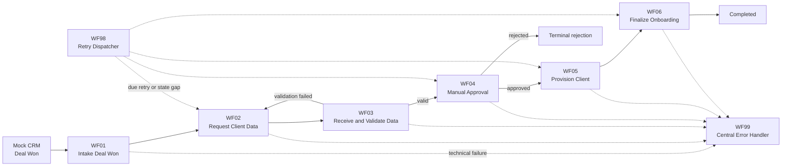
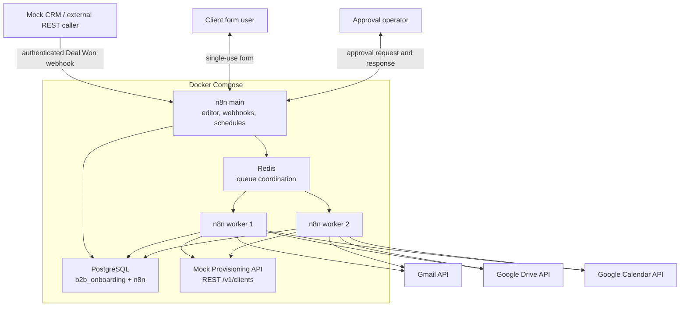

# Production-Grade B2B Client Onboarding Platform

End-to-end B2B onboarding automation built with **n8n, PostgreSQL, Redis, Docker, and Google Workspace integrations**.

The platform coordinates the process from an authenticated CRM `Deal Won` event through client-data collection, validation, manual approval, external provisioning, Google Drive and Calendar setup, team notification, and durable completion. PostgreSQL remains authoritative while n8n orchestrates people, APIs, retries, and recovery.

> **Project status:** this is a locally tested portfolio implementation, not a claimed customer production deployment. Mock CRM input and the Mock Provisioning API are replaceable integration adapters. No commercial outcomes or production-scale metrics are claimed.

| Repository evidence | Current tracked scope |
| --- | ---: |
| Coordinated n8n workflows | 8 |
| Exported n8n nodes | 310 |
| Ordered database migrations | 14 |
| Application tables | 8 |
| SQL test suites / assertions | 5 / 46 |
| Docker Compose services | 6 |

## Contents

- [Problem](#problem)
- [Solution](#solution)
- [Workflow overview](#workflow-overview)
- [WF01: Deal Won intake](#wf01-deal-won-intake)
- [Architecture](#architecture)
- [Reliability design](#reliability-design)
- [Database overview](#database-overview)
- [Testing and runtime evidence](#testing-and-runtime-evidence)
- [Repository structure](#repository-structure)
- [Local setup](#local-setup)
- [Environment variables](#environment-variables)
- [Demo evidence](#demo-evidence)
- [Tech stack](#tech-stack)
- [Honest project status](#honest-project-status)

## Problem

Manual B2B onboarding is often fragmented across CRM notes, email threads, spreadsheets, shared folders, calendars, and internal tools. This creates predictable engineering risks:

- repeated data entry and inconsistent client records;
- duplicate external actions when events or jobs are retried;
- unreliable retries after partial failures;
- limited observability across the complete onboarding lifecycle;
- manual creation of Drive folders, Calendar events, and notifications;
- unclear ownership of state when multiple workers act concurrently;
- workflow execution history becoming an accidental business datastore.

## Solution

The system separates orchestration from authoritative state:

- **PostgreSQL** owns cases, steps, submissions, tokens, clients, external-operation state, audit events, and errors.
- **n8n** validates workflow contracts and coordinates human and external-system interactions.
- **Redis** provides queue coordination for n8n main and two workers.
- **Docker Compose** runs the local platform as one repeatable stack.
- **Google Workspace integrations** deliver email, create onboarding folders, and schedule kickoff events.
- **The Mock Provisioning API** provides a deterministic REST boundary for success, replay, retryable failure, and terminal failure testing.

The business flow is:



Validation failure starts a new client-data request cycle. Approval rejection is terminal. Retryable technical failures remain persisted until PostgreSQL says they are due for another attempt.

## Workflow overview

| Workflow | Responsibility | Export and contract |
| --- | --- | --- |
| **WF01 Intake Deal Won** | Authenticate, validate, normalize, and persist a CRM event; resolve duplicates and source conflicts; invoke WF02 when required. | [Export](n8n/workflows/WF01-intake-deal-won.json) · [Contract](docs/workflow-contracts/WF01-intake-deal-won.md) |
| **WF02 Request Client Data** | Prepare a secure request cycle, deliver a single-use form link through Gmail, and persist or reconcile delivery. | [Export](n8n/workflows/WF02-request-client-data.json) · [Contract](docs/workflow-contracts/WF02-request-client-data.md) |
| **WF03 Receive and Validate Client Data** | Authorize the form token, store an immutable submission, validate business data, and link a canonical client. | [Export](n8n/workflows/WF03-receive-and-validate-client-data.json) · [Contract](docs/workflow-contracts/WF03-receive-validate-client-data.md) |
| **WF04 Manual Approval** | Send an approval request, wait for an authorized decision, and persist approval or rejection. | [Export](n8n/workflows/WF04-manual-approval.json) · [Contract](docs/workflow-contracts/WF04-manual-approval.md) |
| **WF05 Provision Client** | Call the idempotent provisioning REST API and persist the external client ID or classified failure. | [Export](n8n/workflows/WF05-provision-client.json) · [Contract](docs/workflow-contracts/WF05-provision-client.md) |
| **WF06 Finalize Onboarding** | Create or reconcile the Drive folder, kickoff event, and team notification before completing the case. | [Export](n8n/workflows/WF06-finalize-onboarding.json) · [Contract](docs/workflow-contracts/WF06-finalize-onboarding.md) |
| **WF98 Retry Dispatcher** | Find due retries, expired leases, and supported state gaps, then dispatch recovery to the owning workflow. | [Export](n8n/workflows/WF98-retry-dispatcher.json) · [Contract](docs/workflow-contracts/WF98-retry-dispatcher.md) |
| **WF99 Central Error Handler** | Sanitize and persist technical failures and coordinate deduplicated operator-intervention notifications. | [Export](n8n/workflows/WF99-central-error-handler.json) · [Contract](docs/workflow-contracts/WF99-central-error-handler.md) |

## WF01: Deal Won intake

WF01 is the public entry boundary for the onboarding process. Its 15-node export implements:

1. n8n Header Auth before business processing;
2. content-type, payload, and required-field validation;
3. deterministic normalization of source, deal, company, contact, and metadata fields;
4. one PostgreSQL transaction through `process_wf01_intake`;
5. source-event idempotency and source-identity conflict detection;
6. creation of one case and its seven steps when the deal is new;
7. conditional dispatch to the real WF02 workflow;
8. explicit dispatch-error routing to WF99 without rolling back committed intake data.

### Intake outcomes

| HTTP | Confirmed outcome |
| ---: | --- |
| `201` | A new event and deal create one case; WF02 is invoked. |
| `200` | A duplicate event or a new event for an existing deal reuses the same case; WF02 is not duplicated. |
| `400` | A syntactically valid payload violates the input contract. |
| `403` | Built-in n8n Header Auth rejects invalid credentials before WF01 executes. |
| `409` | A known source event is presented with a conflicting deal identity. |
| `415` | The request uses an unsupported content type. |
| `422` | n8n rejects malformed JSON before the first WF01 node executes. |
| `500` | WF02 dispatch acceptance fails after the intake transaction; WF99 records the technical failure. |

The runtime suite uses a unique `event_id` and `deal_id` for every run, polls asynchronous state with a timeout, checks HTTP responses and PostgreSQL counts, and restores the real WF02 target plus the original active/published workflow state after fault injection.

## Architecture



Business state does not depend on n8n execution retention. See [the architecture document](docs/architecture.md) for the state machine, trust boundaries, and external-operation protocol.

## Reliability design

| Pattern | Implementation |
| --- | --- |
| PostgreSQL source of truth | Workflows reread authoritative case, step, token, and operation records before state-sensitive actions. |
| Idempotency keys | Every external side effect has a deterministic key; the provisioning API also consumes `Idempotency-Key`. |
| Database constraints | Unique source identities, valid states, one operation per key, immutable submissions, and token lifecycle rules are enforced in SQL. |
| Leases | Atomic claims use an owner and expiry so concurrent workers cannot perform the same operation simultaneously. |
| Retry scheduling | Attempt count, maximum attempts, and `next_retry_at` are persisted; WF98 selects due work using PostgreSQL time. |
| Reconciliation | Gmail markers, Drive `appProperties`, and Calendar private extended properties are checked before ambiguous actions are repeated. |
| Duplicate prevention | Replayed CRM events, provisioning calls, email sends, folders, and events reuse persisted identities. |
| Append-only events | A trigger rejects updates and deletes from `onboarding_events`. |
| Central error handling | WF99 sanitizes technical context, writes `error_log`, and deduplicates intervention notifications. |
| Partial-failure recovery | Successful provider work is retained; a later execution resumes from the earliest incomplete or uncertain operation. |

Additional safeguards include single-use expiring form tokens, SHA-256 token hashes, temporary AES-GCM-encrypted delivery material, immutable versioned submissions, transition guards, and separation of business outcomes from technical errors.

## Database overview

The application schema contains eight tables defined by [migration 001](db/migrations/001_foundation.sql) and extended through [migration 014](db/migrations/014_wf01_intake_deal_won.sql).

| Table | Responsibility |
| --- | --- |
| `clients` | Canonical validated client identity and contact data. |
| `onboarding_cases` | One authoritative case per source deal, current state, and accepted client/submission links. |
| `onboarding_steps` | Seven required steps with status, attempts, wait state, decision, and completion fields. |
| `onboarding_form_tokens` | Hashed, expiring, single-use tokens and temporary encrypted delivery material. |
| `onboarding_submissions` | Immutable versioned submissions and deterministic validation results. |
| `onboarding_events` | Append-only idempotent business audit events. |
| `external_operations` | Side-effect identity, lease, attempts, retry schedule, external ID, and sanitized result. |
| `error_log` | Sanitized technical and integration failures. |

Every case receives these seven step records: `collect_client_data`, `validate_client_data`, `manual_approval`, `provision_client`, `create_drive_folder`, `create_kickoff_event`, and `notify_team`.

### Migration groups

- `001`: tables, constraints, triggers, token consumption, operation claims, and guarded transitions;
- `002`–`010`: WF02/WF03 token delivery, reconciliation, retry, and validation finalization;
- `011`: WF04 approval preparation and decision/failure finalization;
- `012`: WF05 provisioning preparation and success/failure finalization;
- `013`: WF06 Drive, Calendar, notification, recovery, and case completion functions;
- `014`: atomic WF01 intake resolution, idempotency, and source-identity validation.

Key database APIs include `process_wf01_intake`, `claim_external_operation`, `complete_external_operation_success`, `complete_external_operation_failure`, `finalize_wf03_validation`, the WF04/WF05/WF06 preparation and finalization functions, and `complete_wf06_onboarding`.

## Testing and runtime evidence

### SQL tests

The five SQL suites run in transactions and roll back their fixtures:

```bash
for test_file in db/tests/*.sql; do
  docker compose exec -T postgres sh -lc \
    'psql -X -v ON_ERROR_STOP=1 -U "$APP_DB_USER" -d "$APP_DB_NAME"' \
    < "$test_file"
done
```

Current verified result: **46 assertions passed** across foundation, WF01, WF04, WF05, and WF06 suites.

### WF01 runtime scenarios

[`scripts/test_wf01_runtime.sh`](scripts/test_wf01_runtime.sh) automates scenarios A–I. The Header Auth value is supplied only at runtime:

```bash
WF01_AUTH_HEADER='replace-with-local-header-value' \
  ./scripts/test_wf01_runtime.sh
```

The suite verifies:

- new Deal Won intake and WF02 delivery;
- duplicate event and existing-deal suppression;
- source-identity conflict;
- missing email and unsupported content type;
- n8n malformed-JSON `422` and Header Auth `403` behavior;
- a temporary missing-WF02 fault, WF99 completion, one `error_log` record, and restoration of the real workflow configuration.

Running this suite with real Google credentials sends one test Gmail message; it should be used deliberately.

### Mock Provisioning API

```bash
docker compose exec -T mock-provisioning-api npm test
```

The six Node.js tests cover health, idempotent replay, conflicting payloads for one key, retryable-once recovery, persistent retryable failure, and terminal rejection.

### Static workflow checks

```bash
docker compose config --quiet

for workflow in n8n/workflows/*.json; do
  jq empty "$workflow"
done

bash -n scripts/test_wf01_runtime.sh
git diff --check
```

The current repository contains **8 workflow exports, 310 nodes, and 137 Code nodes**. Code-node syntax is also compiled with Node.js during local verification.

### Confirmed local runtime evidence

The following evidence was produced locally with Docker, n8n queue mode, PostgreSQL, Redis, the mock API, and configured Google integrations:

- WF01 scenarios A–I passed with HTTP and PostgreSQL assertions;
- a new intake created one case and seven steps, invoked WF02 once, and reached `awaiting_client_data`;
- duplicate deliveries did not create another case, business operation, or WF02 dispatch;
- dispatch fault injection returned `500`, retained the committed case in `created`, and produced exactly one WF99 error record;
- a recovery-focused finalization case reached `completed` with all seven steps completed and succeeded Drive, Calendar, and team-notification operations;
- the successful Gmail path retained its case and correlation context; the failure-context path was checked deterministically without forcing another provider failure.

The finalization evidence demonstrates recovery from persisted state. It is not presented as a single uninterrupted customer run from WF01 through WF06.

## Repository structure

```text
.
├── .env.example
├── README.md
├── docker-compose.yml
├── docker-compose.override.yml
├── db/
│   ├── init/                       # Database bootstrap
│   ├── migrations/                 # Ordered migrations 001-014
│   └── tests/                      # Five transactional SQL suites
├── docs/
│   ├── architecture.md
│   ├── project-plan.md
│   └── workflow-contracts/         # WF01-WF06, WF98, WF99
├── n8n/
│   └── workflows/                  # Eight exported workflow JSON files
├── scripts/                        # Runtime checks and targeted deployment helpers
└── services/
    └── mock-provisioning-api/      # Node.js REST adapter and tests
```

## Local setup

### Prerequisites

- Docker Engine or Docker Desktop with Compose v2;
- Git, `curl`, and `jq`;
- Node.js 24 or a compatible modern runtime for direct static and mock-service tests;
- a Google Cloud OAuth project with Gmail, Drive, and Calendar APIs enabled only if exercising real integrations.

### 1. Configure the environment

```bash
git clone https://github.com/Pokhyl/b2b-client-onboarding-platform.git
cd b2b-client-onboarding-platform
cp .env.example .env
```

Replace every `replace_with_...` value. Also add the required local WF99 recipient used by `docker-compose.override.yml`:

```dotenv
OPERATOR_INTERVENTION_RECIPIENT_EMAIL=operator@example.com
```

Never commit `.env`, OAuth tokens, n8n credential exports, form tokens, approval links, email contents, or provider resource identifiers.

### 2. Start the stack

```bash
docker compose up -d --build
docker compose ps
```

The stack starts PostgreSQL, Redis, n8n main, two n8n workers, and the Mock Provisioning API.

### 3. Apply migrations

On a freshly initialized database, apply migrations in order as the application database owner:

```bash
for migration in db/migrations/[0-9][0-9][0-9]_*.sql; do
  docker compose exec -T postgres sh -lc \
    'psql -X -v ON_ERROR_STOP=1 -U "$APP_DB_USER" -d "$APP_DB_NAME"' \
    < "$migration"
done
```

### 4. Import workflows

```bash
for workflow in n8n/workflows/*.json; do
  filename="$(basename "$workflow")"
  docker compose cp "$workflow" "n8n-main:/tmp/$filename"
  docker compose exec -T n8n-main \
    n8n import:workflow --input="/tmp/$filename"
done
```

Open `http://localhost:5678`, relink imported nodes to credentials created in the local n8n instance, verify webhook/form URLs, and activate only the intended workflows. Exported workflow files contain credential references, never credential values.

Required n8n credential types are PostgreSQL, shared Header Auth for protected webhooks, Gmail OAuth2, Google Drive OAuth2, and Google Calendar OAuth2.

### 5. Verify health

```bash
curl --fail http://localhost:5678/healthz
curl --fail http://localhost:3001/healthz
docker compose ps
```

## Environment variables

Use [`.env.example`](.env.example) as the placeholder-only baseline.

| Group | Variables |
| --- | --- |
| PostgreSQL bootstrap | `POSTGRES_ADMIN_USER`, `POSTGRES_ADMIN_PASSWORD`, `POSTGRES_HOST_PORT` |
| Application database | `APP_DB_NAME`, `APP_DB_USER`, `APP_DB_PASSWORD` |
| n8n database | `N8N_DB_NAME`, `N8N_DB_USER`, `N8N_DB_PASSWORD` |
| Redis and queue mode | `REDIS_PASSWORD`, `N8N_WORKER_CONCURRENCY` |
| n8n runtime | `N8N_ENCRYPTION_KEY`, `N8N_HOST`, `N8N_PORT`, `N8N_PROTOCOL`, `N8N_EDITOR_BASE_URL`, `WEBHOOK_URL`, `N8N_VERSION` |
| WF02 request cycle | `CLIENT_DATA_FORM_BASE_URL`, token TTL/encryption settings, WF02 lease/attempt settings, sender/support values |
| WF04 approval | recipient, template, response timeout, lease/attempt, sender/support values |
| WF05 provisioning | `PROVISIONING_API_BASE_URL`, `WF05_PROVISIONING_SCENARIO`, WF05 lease/attempt settings |
| WF06 finalization | Drive parent/template, Calendar/time settings, attendee, and team-notification settings |
| WF99 intervention | `OPERATOR_INTERVENTION_RECIPIENT_EMAIL`; optional sender/template and lease/attempt settings from the Compose override |
| Mock service | `MOCK_PROVISIONING_API_PORT` |

All real passwords, encryption keys, OAuth material, recipients, and Google resource IDs belong only in the local `.env` or n8n credential store.

## Demo evidence

No portfolio screenshots are committed yet, and this README does not use fabricated images.

Useful future evidence, after redaction:

1. **Architecture:** the Compose services alongside the architecture diagram above.
2. **Workflow canvas:** a sanitized WF01 intake route and WF06 reconciliation route.
3. **Database audit trail:** one test case with seven steps, deterministic operations, and append-only events.
4. **Fault injection:** WF01 dispatch failure routed to WF99 with the case retained after commit.
5. **External integration:** sanitized Drive, Calendar, and Gmail test artifacts with all account, email, URL, and resource identifiers removed.

The repository itself provides reproducible evidence through workflow JSON, migrations, SQL tests, the mock API tests, the WF01 runtime script, and the associated Git history.

## Tech stack

| Area | Technology |
| --- | --- |
| Workflow orchestration | n8n 2.30.8, queue mode |
| Workflow logic | JavaScript in n8n Code nodes |
| Business persistence | PostgreSQL 18.4 |
| Queue coordination | Redis 8.8 |
| Local orchestration | Docker Compose |
| External adapter | Node.js 24 Mock Provisioning API |
| Integrations | REST APIs, Gmail, Google Drive, Google Calendar |
| Authentication | Header Auth, n8n credentials, Google OAuth2 |
| Verification | PostgreSQL test scripts, Node.js tests, `jq`, shell syntax checks |

## Honest project status

This repository is a **portfolio implementation of a production-oriented architecture**. It demonstrates durable state, idempotent external operations, bounded retries, reconciliation, duplicate prevention, and recovery after partial failure in a local environment.

The Mock CRM event source and Mock Provisioning API can be replaced with a real CRM, ERP, IAM platform, or internal service API if the adapter preserves the documented authentication, idempotency, and response contracts.

The project has not been presented as a real customer deployment. It makes no claims about revenue, time savings, percentages, service-level objectives, production traffic, or commercial outcomes.
